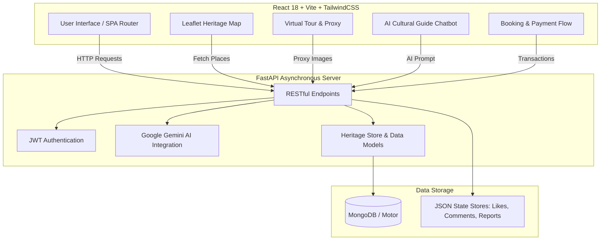

# Heritage & Culture Portal

> Full-stack heritage discovery platform with a React + Vite frontend and a FastAPI backend, featuring interactive geospatial mapping, virtual tours, AI-powered cultural Q&A, secure ticket booking, and community grievance tracking.

---

## 🏛️ Project Architecture & System Overview

The application is structured around a modern decoupled client-server architecture. The frontend communicates asynchronously with the FastAPI backend, which interfaces with MongoDB (via Motor) and Google Gemini AI for intelligent recommendations and chatbot responses.



---

## 🚀 Core Features & Capabilities

- **Interactive Heritage Map:** Powered by Leaflet & React Leaflet for geospatial exploration of Delhi and national monuments.
- **AI Cultural Guide:** Integrated with Google Gemini API to answer cultural queries and provide rich historical context.
- **Virtual Tour Experience:** Immersive 360/panoramic cultural tour views with built-in CORS image proxy support.
- **Explore, Booking & Payment Flow:** Streamlined ticketing system supporting multiple ticket types, visitor verification, and mock UPI/card payment workflows.
- **Community & Citizen Grievance Portal:** Discussion forums with live likes/comments and government reporting endpoints for monument maintenance.
- **PWA & Dark Mode:** Progressive Web App capabilities, service worker setup, and seamless dark/light theme switching with Zustand persistence.

---

## 🛠️ Tech Stack Breakdown

### Frontend
- **Core:** React 18, Vite 5, React Router 6
- **Styling:** TailwindCSS 3, Framer Motion
- **Geospatial & State:** React Leaflet, Leaflet, Zustand, i18next

### Backend
- **Core:** FastAPI, Uvicorn, Python 3.11+
- **Database:** Motor (Async MongoDB), PyMongo
- **AI & Security:** `google-genai` (Gemini API), `passlib` (Bcrypt)

---

## 📂 Workspace Structure

```text
INNOVIT-HACKATHON/
├── backend/
│   ├── .env
│   ├── .env.example
│   ├── Procfile
│   ├── main.py
│   ├── mongo.py
│   ├── auth.py
│   ├── chatbot.py
│   ├── recommend.py
│   ├── user.py
│   ├── bookings.py
│   ├── payments.py
│   ├── data.py
│   ├── delhi_places.py
│   ├── india_places.py
│   └── requirements.txt
├── FRONTEND/
│   ├── src/
│   │   ├── App.jsx
│   │   ├── main.jsx
│   │   ├── components/
│   │   ├── pages/
│   │   ├── config/api.js
│   │   ├── store/useStore.js
│   │   └── styles/main.css
│   ├── package.json
│   ├── tailwind.config.cjs
│   └── vite.config.js
├── likes.json
├── comments.json
├── user.json
└── README.md
```

---

## ⚡ Quick Start & Local Development

### Prerequisites
- Node.js 18+ & npm
- Python 3.11+ & pip

### 1) Backend Setup
```bash
cd backend
pip install -r requirements.txt
# Configure your .env file with MONGO_URL and GEMINI_API_KEY
uvicorn main:app --host 127.0.0.1 --port 8000 --reload
```
*Backend runs at:* `http://127.0.0.1:8000` (Interactive Swagger Docs at `/docs`)

### 2) Frontend Setup
```bash
cd FRONTEND
npm install
npm run dev -- --host 127.0.0.1 --port 5173
```
*Frontend runs at:* `http://127.0.0.1:5173`

---

## 🗺️ Frontend Routes

| Route | Page Component | Description |
|---|---|---|
| `/` | `Home` | Hero section, featured heritage highlights, quick stats |
| `/login` | `Login` | Secure user authentication and signup portal |
| `/heritage` | `Heritage` | Interactive geospatial monument map |
| `/festivals` | `Festivals` | Cultural festivals calendar and overview |
| `/arts` | `ArtCrafts` | Traditional arts, crafts, and artisan stories |
| `/explore` | `Explore` | Discovery engine with booking & payment flow |
| `/virtual-tour` | `VirtualTour` | Immersive panoramic virtual tour |
| `/community` | `TourismEventCoPublishing` | Community discussions and citizen reporting |
| `/about` & `/contact` | `About` / `Contact` | Portal background and support channels |

---

## 🔌 Backend REST API Reference

```mermaid
sequenceDiagram
    participant Client as Frontend (React)
    participant Server as FastAPI Backend
    participant AI as Google Gemini AI
    participant DB as MongoDB / JSON Store

    Client->>Server: GET /places
    Server-->>Client: Heritage Places Catalog

    Client->>Server: POST /chat {message}
    Server->>AI: Generate Cultural Response
    AI-->>Server: AI Insights
    Server-->>Client: Return Response

    Client->>Server: POST /bookings {user_id, place_key, ...}
    Server->>DB: Save Booking Record
    DB-->>Server: Confirmed
    Server-->>Client: Booking Object

### Core Endpoints
- `GET /` — Health check status message
- `GET /places` — Retrieve all heritage places
- `GET /places/{place_key}` — Retrieve single place details
- `GET /proxy-image?url=...` — Image proxy for virtual tour CORS handling

### User Authentication & AI
- `POST /signup` — Register new user account
- `POST /login` — Authenticate and receive JWT access token
- `POST /recommend` — Generate personalized cultural itineraries
- `POST /chat` — AI cultural Q&A via Google Gemini

### Bookings & Payments
- `POST /bookings` — Create a monument visit booking
- `GET /bookings?user_id=...` — Fetch user bookings
- `POST /payments` — Process payment (Card / UPI)

### Community & Government Metrics
- `GET /discussions` — Fetch discussion threads with aggregated likes & comments
- `POST /like` — Register discussion like
- `GET` / `POST` / `DELETE /comments` — Manage community comments
- `GET /gov/metrics` — High-level statistics on sites, discussions, and reports
- `GET` / `POST /gov/reports` — Citizen grievance and maintenance reporting

---

## 🚢 Deployment Guidelines

- **Frontend:** Pre-configured for **Vercel** deployment (`FRONTEND/vercel.json`).
- **Backend:** Ready for production deployment on Uvicorn-compatible container platforms (Render, Railway, Heroku) using `Procfile` and `requirements.txt`.
- **Environment Variables:** Ensure `MONGO_URL` and `GEMINI_API_KEY` are securely defined in your production runtime environment.

---
*Project created for the INNOVIT Hackathon.*
